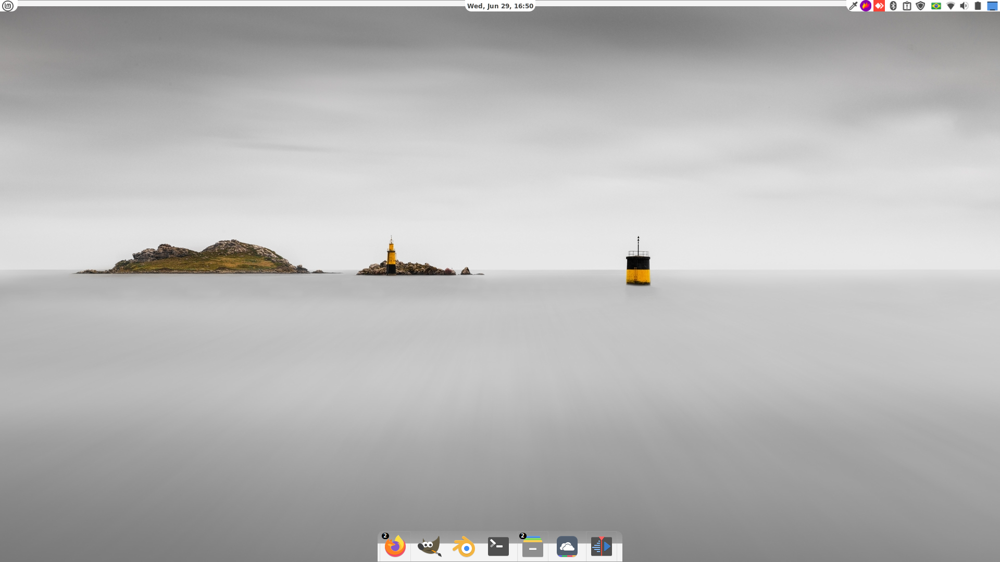
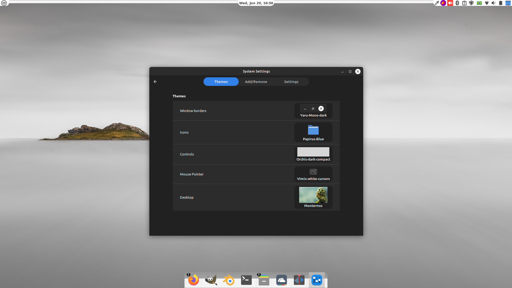

# Linux Mint minimalista

Configuração do Linux Mint para um visual moderno e elegante, versão Cinnamon.

Ao final seu tema deve ser parecido com o da imagem abaixo: 

 

  

## Configuração do tema:

1 - Instale o tema Monternos e configure-o
- Mova a barra de aplicativos para cima clicando em Move com botão direito mouse;
- Adicione um novo painel no lugar do antigo na parte inferior;
- Mova os aplicativos da barra superior para a inferior;
- Mova o relógio para o centro da barra superior;
- Em configuração do painel coloque-o em intelligent hide.

2 - Crie uma pasta chamada .icons na sua HOME;

3 - Copie a pasta Papirus-Blue para essa pasta .icons

4 - Copie a pasta chamada volantes_cursors para dentro da pasta .icons.

5 - Dentro da pasta .themes na sua HOME copie as pastas Yaru-Mono-dark e Orchis-dark-compact.

  

A ídeia aqui é deixar seu linux com um visual bonito e diferenciado, espero que gostem das modificações no visual.

### Você pode ver como configurei esse setup no Youtube também:

